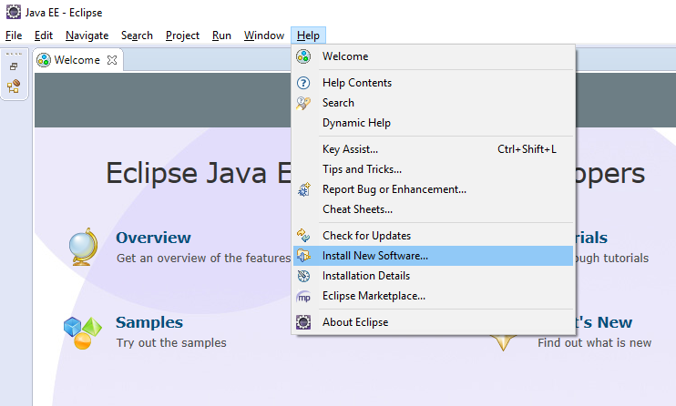
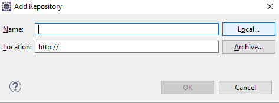
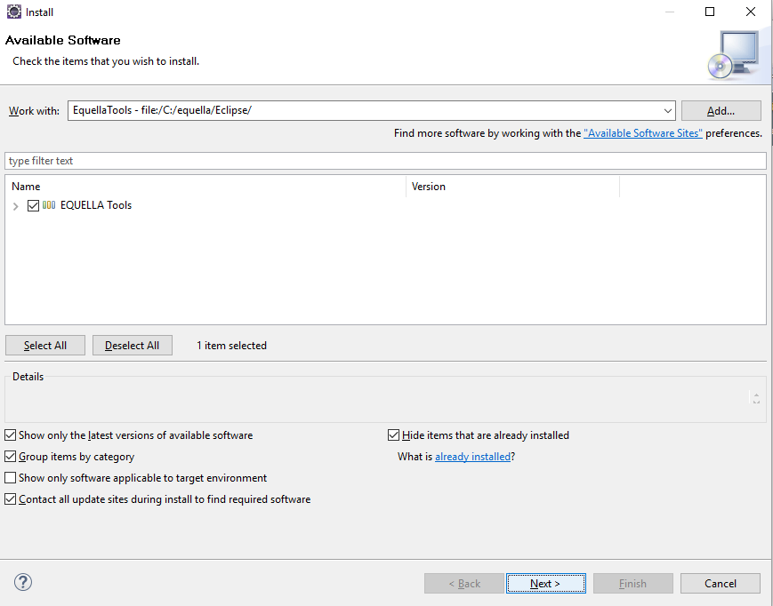
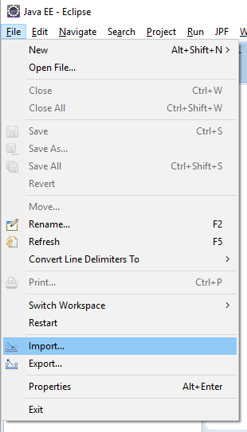
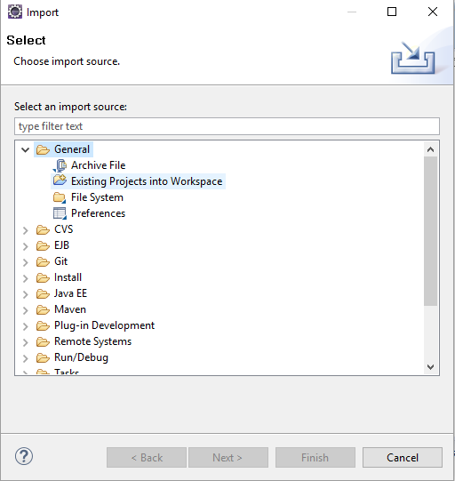
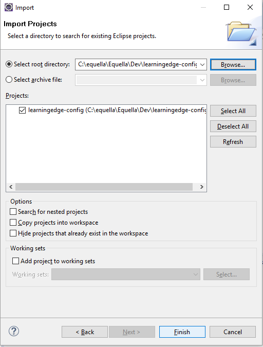

[Home](https://equella.github.io/)

# Setting Up an Equella Dev Environment 


* [Download required software](#download-required-software)
* [Get the code](#get-the-code)
* [Install software into Eclipse](#install-software-into-eclipse)
* [learningedge-config](#learningedge-config)
* [Generate dynamic source code](#generate-dynamic-source-code)
* [Tomcat VM arguments](#tomcat-vm-arguments)
* [Installation of the Vanilla institution](#installation-of-the-vanilla-institution)


## Download required software

**Download Eclipse**

<http://www.eclipse.org/downloads/packages/eclipse-ide-java-ee-developers/mars2>

**Download and install Git**

<https://git-scm.com/downloads>

**Download and install Ant** 

<http://ant.apache.org/bindownload.cgi>

**Download and install Java 8 JDK**

<http://www.oracle.com/technetwork/java/javase/downloads/jdk8-downloads-2133151.html>


**Download and install Image Magick binaries** 

<http://www.imagemagick.org/script/binary-releases.php>

*Note: For ubuntu follow the install from Unix Source instructions:*
<https://www.imagemagick.org/script/install-source.php>

They are installed in /usr/local/lib

When installing in Windows, check “Install Legacy Utilities (e.g. convert)”.


**Download and install a DB server** (Postgres is easiest) 

<http://www.postgresql.org/download/>

*Note: For ubuntu this is useful:*

<https://www.digitalocean.com/community/tutorials/how-to-install-and-use-postgresql-on-ubuntu-14-04>

**Download and install libav**

In ubuntu:

```
sudo apt-get install libav-tools
```

They are installed in /usr/lib


Once Ant and Java are installed, you will need to set a JAVA_HOME environment variable. Also at this point it is a good idea to make sure ant\bin is on your PATH. 

## Get the code 

**Git Clone** 

git clone git@github.com:equella/Equella.git


**Initialize dev environment** 

Open a command window and CD to your code folder. 

Run the following commands: 
* ant generate-build-properties
* ant generate-version-properties 

**Download jar files**

We need to copy several things to our home folder:

1. <https://bitbucket.org/equellateam/equella-master/downloads/equella-deps.zip>
The .zip contains an "equella-deps" folder which must be place in your home directory for the ant scripts to find it.
2. We need the equella.keystore in our home folder too
3. Run “ant release” from the root folder of the project and the results will be in the products folder.

### Unzip and run installer

Unzip the installer and copy initial build into it:

**unzip product/equella-{VERSION}-installer-{VERSION}.zip -d ~
cp product/tle-upgrade-{VERSION}.zip ~/equella-{VERSION}-installer-{VERSION}/manager/updates/**

Run the GUI installer:

**cd ~/equella-{VERSION}-installer-{VERSION}
java -jar enterprise-install.jar**

Follow the prompts ensuring you have entered the correct
* JDK directory
* Database type/host/username/password
* Path to imagemagick
* Path to avconv

### Running the manager and starting the app
Firstly if on unix ensure that the manager and scripts are executable:

**cd {install_location}/manager**

**chmod +x equellaserver manager jsvc**

Start up the manager:

**cd {install_location}/manager**

**./manager start**

Use your browser to login to the EQUELLA manager (default is <http://localhost:3000>)
From here you can click the "start" button to start the EQUELLA app server. Once it has started you can log in to the server admin using the hostname and port you configured in the installer and finish the installation process.


## Install software into Eclipse 

You need to install our Eclipse plugin to generate project classpaths from the plugin jpf in order for our code to compile in Eclipse. This needs to be done after running “ant release” from the command line. 

1. Download the plugin from <http://maestro.equella.com/file/1ced94d5-9506-4ce5-b3e0-2c476e7102fb/1/_zips/Eclipse.zip> 
**(NOTE NEED TO CHANGE THE ABOVE TO ANOTHER LOCATION OUTSIDE OF MAESTRO)**

2. Extract the zip file to the local file system.
3. Open Eclipse and navigate to Help > Install New Software…



4. Click Add

5. Click Local



6. Navigate to the extracted zip file with the features and plugins directory.
7. Enter a name (e.g. EquellaTools)
8. Click OK
9. Check Equella Tools 
10. Click Next

11. Click Next
12. Select “I accept the terms of the license agreement”
13. Click Finish
14. As the plugin is being installed, you may encounter a security warning.  Click OK.

15. Restart Eclipse
16. Import Projects into Workspace

a. Click File > Import…



b. Select General > Existing Projects into Workspace



c. Click Browse

d. Navigate to the main directory in you code source

e. Click OK

f. Select all projects

g. Click Finish

Every project should now have a classpath container called "JPF Dependencies" which is generated automatically from the plugin-jpf.xml file. 

More details on the eclipse plugin can be found here <http://download.eclipse.org/webtools/repository/luna> (Maybe not required... need to check) 


**Run the project from eclipse**

1. From the shell, in the code root folder, run “ant generate-config”
2. Search in eclipse the project called learningedge-config (if the project is not there, import it from the sources folder : DEV/learningedge-config)

    a. To import the project, click File > Import...
    
    
    
    b. Select General > Existing Projects into Workspace
    
    
    
    c. Click Browse
    
    d. Navigate to the Dev\learningedge-config directory in you code source
    
    e. Click OK
    
    f. Check the learningedge-config project
    
    
    
    g. Click Finish

3. Modify the hibernate.properties with your own parameters.
a. You will need to create the equella database if it does not already exist
4. In the eclipse project: EQUELLA Server, copy and paste the file EQUELLA Server.launch.example renaming it to EQUELLA Server.launch
5. Click with the right button on the file EQUELLA Server.launch and run as EQUELLA server. 


## Learningedge-config 

From the products folder, Unzip the equella installer zip in the place you want to run it.

There are several folders. One is learningedge-config

Go through all the files and ensure the settings are set to something sensible, e.g. the file path settings need to be changed to point to the locations that you installed various software. Also make sure the database settings are correct for your installation. 

## Generate dynamic source code 
**(Need to verify)**

Find the org.eclipse.birt.org project, and right click on the build.xml file within that project. Select Run As -> Ant Build... and then select the 'make' target and click Run. Refresh the project when the console window shows a success message. 

The Debug menu should already contain a launcher for the Equella server. Just run this. 

## Tomcat VM arguments 

Add the following VM arguments to your Tomcat runner: 

```
-Xrs -Xms64m -Xmx1500m -XX:MaxPermSize=256m -Djava.net.preferIPv4Stack=true 
-Djava.net.preferIPv6Addresses=false 
-Djava.awt.headless=true -XX:MaxGCPauseMillis=500 -XX:NewRatio=3 -XX:GCTimeRatio=16 
-XX:+DisableExplicitGC 
-XX:+UseConcMarkSweepGC -XX:+UseParNewGC -XX:CMSInitiatingOccupancyFraction=70 
```

If you see "failed sending message to null" error, add: 
```
-Djava.net.preferIPv4Stack=true 
```

Enable debugging mode: 
```
-Dequella.debug=true 
```

Enable autotest mode: 
```
-Dequella.autotest=true 
```

Go to the classpath tab and add the learningedge-config project.


## Installation of the Vanilla institution
1. Once equella manager is started and the server is launched, we can access to the UI using the “admin” user with the password we defined in the installation process.
2. Import the vanilla zip file 
3. The admin user is “demosysadmin” and the password can be defined in the import process.
  a. There are other users… 
    i. democontentadmin
    ii. demolibrarian
    iii. demostudent
    iv. Demoteacher
4. To run the admin console in ubuntu:
javaws admin.jnlp

NOTE: When running equella from eclipse, the vanilla institution is imported with the installed equella data which has a different "filestore" location than the eclipse one. That means that you're pointing your dev instance to the same database as the installed one but it has a different "filestore" location 

**So you there are 2 options to make this work fine:**
1. (Preferred) 
Imples to share the database, the filestore and the freetext between your installed and dev instances 

To do that you need to copy these properties:
* Filestore.root
* freetext.index.location
* Freetext.stopwords.file

rom ${installed}/learningedge-config/mandatory-config.properties into your dev mandatory-config in the eclipse learningedge-config project 

2. Don't share database between instances

You will need to create a new database for the dev instance and use that in your hibernate.properties


