Duplicate checking
==================

openEQUELLA 2019.2 sees the introduction of attachment duplicate checking, as
well as enhancements to the existing edit box duplicate checking functionality.

Configuring duplicate checking
------------------------------

Duplicate checking is configured from the attachment or edit box wizard control
in the Collection Definition Editor, accessed from the Administration Console.

### Attachments

Attachment duplicate checking allows administrators to notify contributors of
existing items that have the same attachments. This includes *Files* and *URL
Links* attachment types. For example, if duplicate checking is enabled for
‘Files’ in an attachment control in a contribution wizard, the contributor sees
a **Duplicate warning** message if a file a contributor uploads is an exact
match to a file that has been uploaded in one or more existing items in the same
collection. A link is provided to those items so they can be viewed before
proceeding.

The duplicate checking for attachments is switched on in the configuration
sections for *Files* and *URL Links* attachment types.

##### To enable File duplicate checking

1.  From the **Administration Console**, select **Collection Definitions**. An
    example is shown in Figure 1

   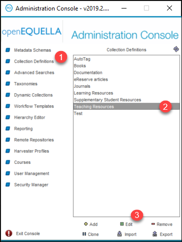

   Figure 1 Administration Console - Collection Definitions

2.  Double click the collection containing the relevant attachment control (or
    highlight and select **Edit)**.

3.  From the **Wizard** tab, select the attachment control with the *Files*
    attachment type that requires duplicate checking to be applied.

4.  Scroll to the **Files** configuration section and check **Enable duplicate
    checking.** An example is shown in Figure 2.

   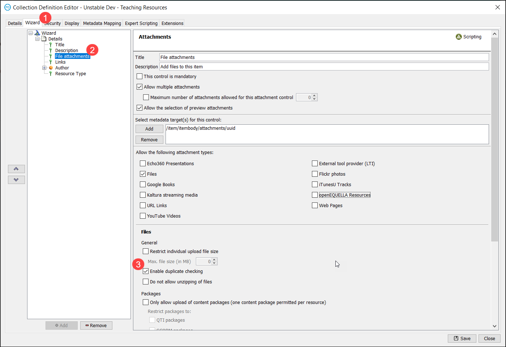

   Figure 2 Attachment control – Files configuration

5.  Click **Save.**

##### To enable URL duplicate checking

1.  From the **Administration Console**, select **Collection Definitions**. An
    example is shown in Figure 3.

   

   Figure 3 Administration Console - Collection Definitions

2.  Double click the collection containing the relevant attachment control (or
    highlight and select **Edit)**.

3.  From the **Wizard** tab, select the attachment control with the *URL Links*
    attachment type that requires duplicate checking to be applied.

4.  Scroll to the **URL Links** configuration section and check **Enable
    duplicate checking.** An example is shown in Figure 4.

   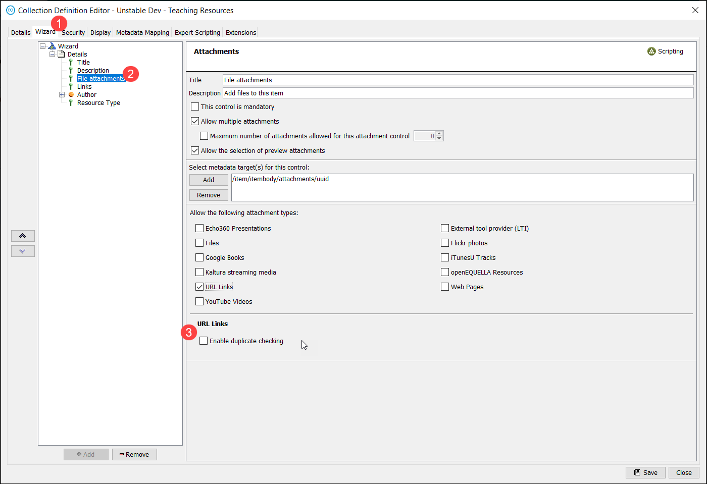

   Figure 4 File attachment control – URL Links configuration

5.  Click **Save.**

### Edit boxes

Duplicate checking for edit boxes allows administrators to notify contributors
of existing items that contain the exact text string entered in the same edit
box field. For example, if duplicate checking is enabled for the ‘Title’ edit
box in a contribution wizard, the contributor sees a **Duplicate warning**
message if the text they have entered for the title is an exact match to the
text in the ‘Title’ field for one or more existing items in the same collection.
A link is provided to those items so they can be viewed before proceeding.

Duplicate checking can be switched on for multiple edit box wizard control in
one collection. For example, duplicate checking could be enabled for both the
‘Title’ and ‘Description’ fields in one contribution wizard. Any text entered in
the ‘Title’ field would be matched against existing item titles within the
collection, and any text entered in the ‘Description’ field matched against
existing item descriptions within the collection.

##### To enable Edit box duplicate checking

1.  From the **Administration Console**, select **Collection Definitions**. An
    example is shown in Figure 5.

   

   Figure 5 Administration Console - Collection Definitions

2.  Double click the collection containing the relevant edit box (or highlight
    and select **Edit)**.

3.  From the **Wizard** tab, select the edit box that requires duplicate
    checking to be applied.

4.  Select **Warn contributor if data in this field is not unique for resources
    in this collection.** An example is shown in Figure 6.

   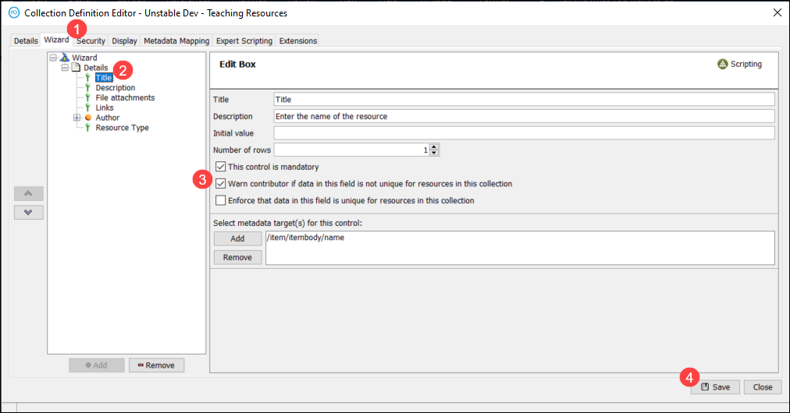

   Figure 6 Collection Definition Editor - Wizard tab

5.  Click **Save.**

Duplicate checking during contribution
--------------------------------------

Duplicate checking occurs during the contribution and editing of items.

### Attachment duplicate checking

A duplicate warning message displays as soon as a file has completed uploading
or a URL Link is added if an exact match is identified in one or more items in
the same collection.

NOTE: File duplicate checking works using MD5 hashes, so the same files with
different names are still identified as duplicates if uploaded.

NOTE: Attachment duplicate checking does not search for matches in items with
the status of Deleted, Suspended, Archived or Rejected.

An example is shown in Figure 7.

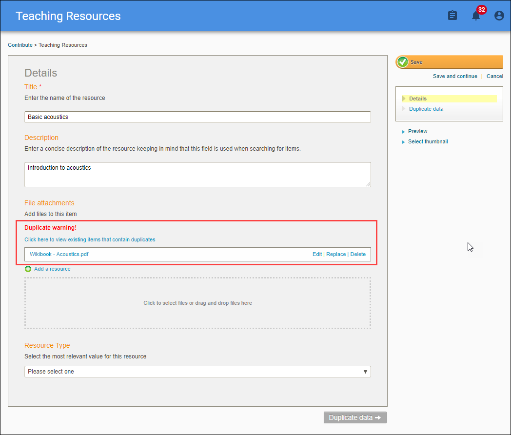

Figure 7 File duplicate warning

Click on the **Click here to view existing items that contain duplicates** link
to open the **Duplicate data** page. A list of items containing matching text
displays. An example is shown in Figure 8.

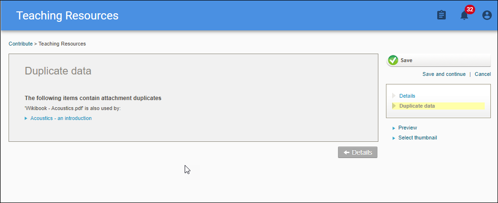

Figure 8 Duplicate data page

Note that the contributor can choose to ignore the duplicate warning and save
the item without opening the link. The Duplicate data page can still be viewed
when editing the item.

Click on the item links to open the items in new tabs.

The **Duplicate data** page can also be accessed from the pages box and using
the navigation button.

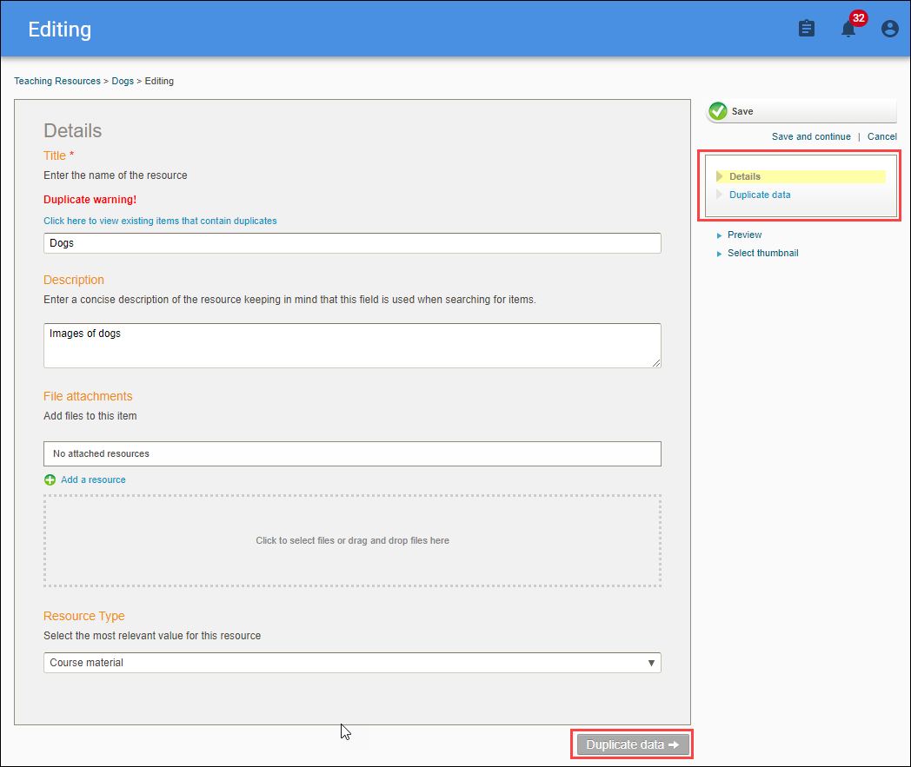

Figure 9 Navigating to Duplicate data page

### Edit box duplicate checking

A duplicate warning displays as soon as the focus moves from the edit box when
an exact match is identified in one or more items in the same collection. An
example is shown in Figure 10.

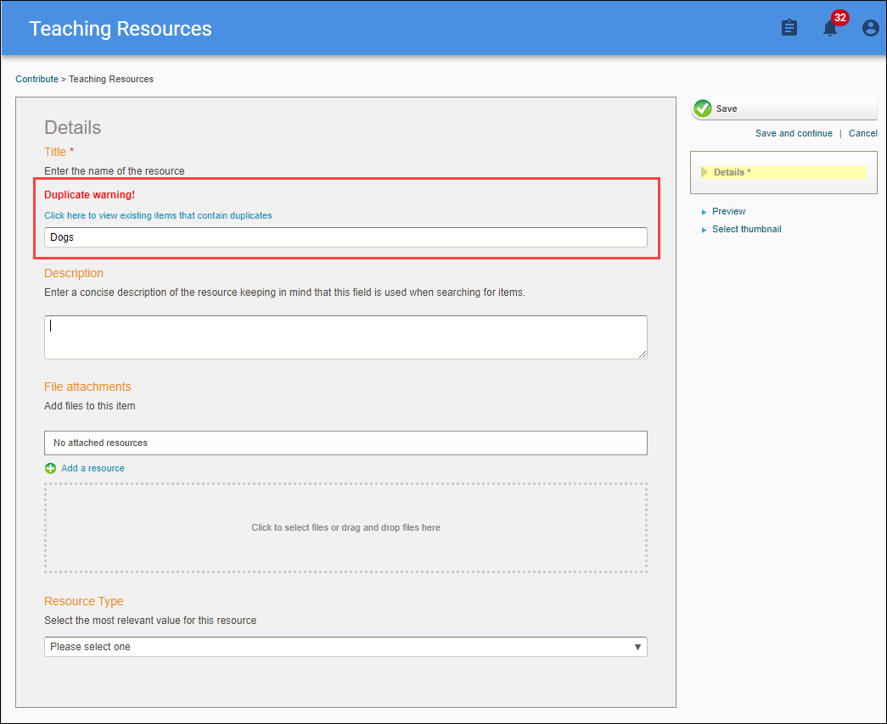

Figure 10 Edit box duplicate warning

Note that the contributor can choose to ignore the duplicate warning and save
the item without opening the link. The Duplicate data page can still be viewed
when editing the item.

Click on the **Click here to view existing items that contain duplicates** link
to open the **Duplicate data** page. A list of items containing matching text
displays. An example is shown in Figure 11.

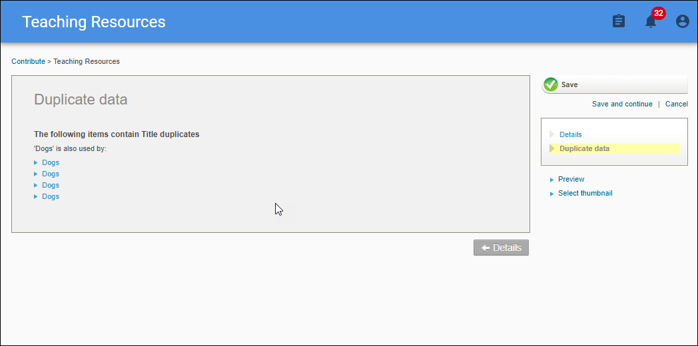

Figure 11 Duplicate data page

Click on the item links to open the items in new tabs.

The **Duplicate data** page can also be accessed from the pages box and using
the navigation button. An example is shown in Figure 12.

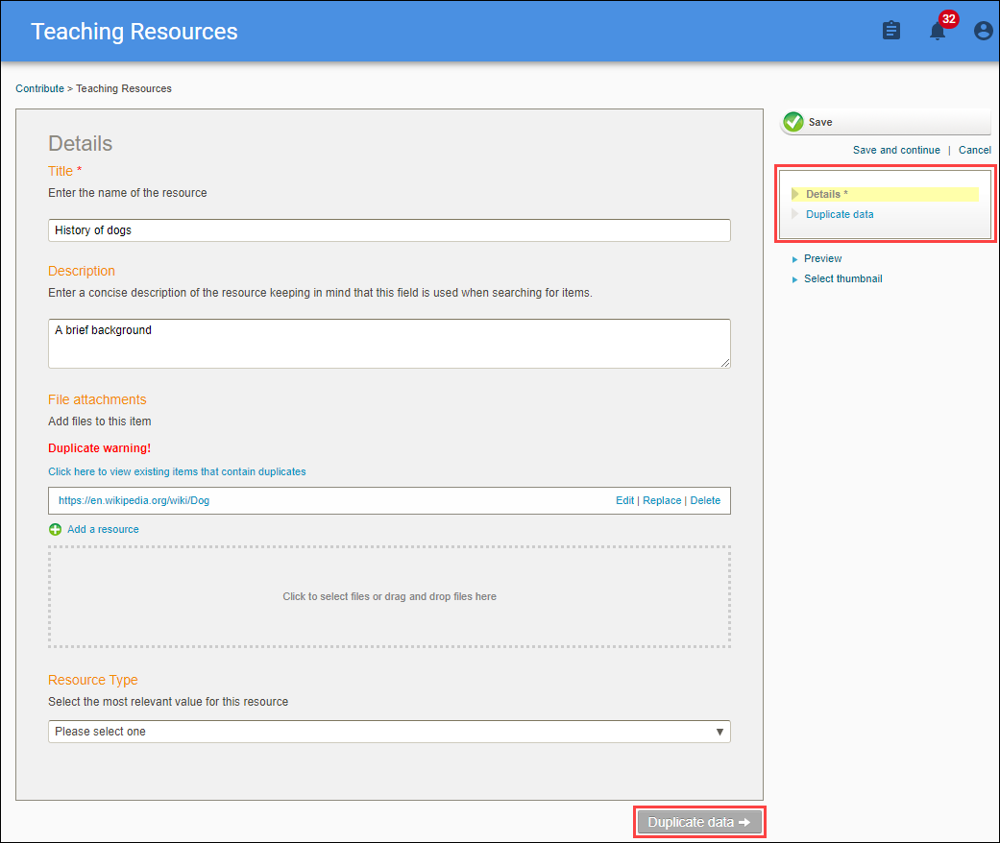

Figure 12 Navigating to Duplicate data page

### Multiple duplicate types

In the case of the detection of multiple duplicates across edit boxes and
attachment controls during contribution, openEQUELLA shows multiple duplicate
warnings. An example is shown in Figure 13.

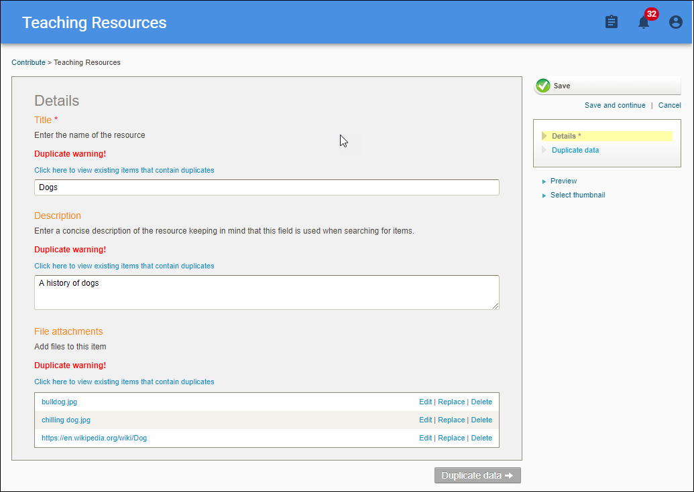

Figure 13 Item contribution with multiple duplicate warnings

The **Duplicate data** page displays the duplicate items for each wizard control
separately. Additionally, for multiple attachment duplicates, each attachment is
listed separately. An example is shown in Figure 14.

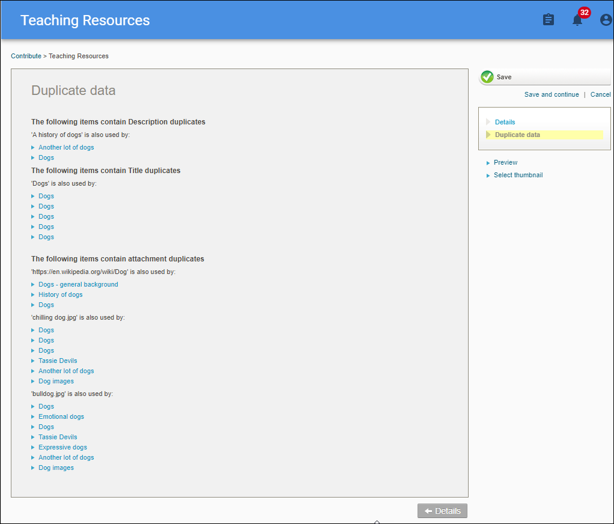

Figure 14 Duplicate data page with multiple duplicate lists

Displaying deleted user names
-----------------------------

openEQUELLA 2019.2 now stores owner details in the database so that if a user is
deleted, past ownership and moderation information are not lost.

NOTE: Users must log in to openEQUELLA at least once prior to their deletion for
this functionality to apply.

When a user is removed from openEQUELLA, the system will now display the deleted
user’s name with the word ‘*removed’* in brackets e.g. *Joe Bloggs (removed)*
instead of ‘Unknown user’ in the Owner field, the Moderation history page and
the Owners and collaborators page. This applies to both local openEQUELLA users
and users managed by integrated external user management systems such as LDAP.

An example of the Resource summary page for an item with a deleted owner is
shown in Figure 15.

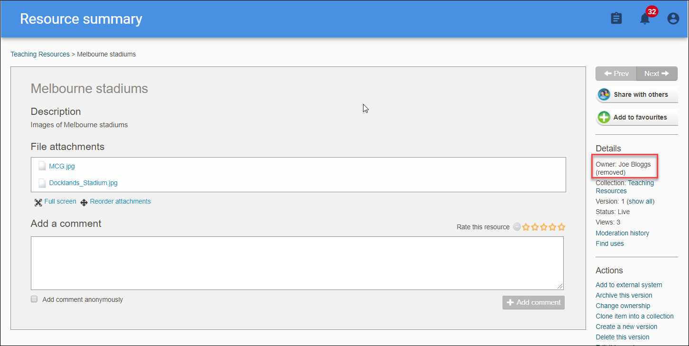

Figure 15 Owner field with deleted user's details

An example of the Moderation history page (accessed from Details, Moderation
History) with a deleted user’s details is shown in Figure 16.

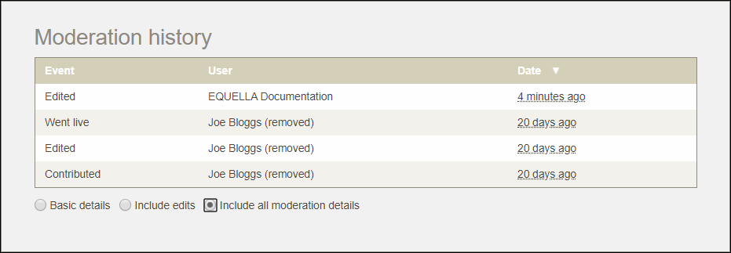

Figure 16 Moderation history page with deleted user details

NOTE: If an item has been through a workflow process, the details of any
workflow task moderators that have been removed from the system display on this
page.

An example of the **Owner and collaborators** page (accessed from **Actions,
Change ownership**) is shown in Figure 17.

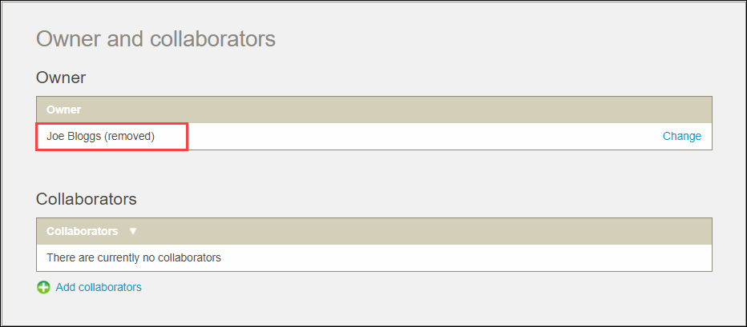

Figure 17 Owners and collaborators page with deleted user details

### Filtering items with deleted owners

The existing **Show items with not owner** filtering option accessed from the
**Filter** panel on the Manage Resources page can be used to view only items
that have a deleted user recorded as the owner. It will also return any records
that have the original ‘Unknown user’ label displaying for users that were
deleted prior to the openEQUELLA 2019.2 update.

An example is shown in Figure 18.

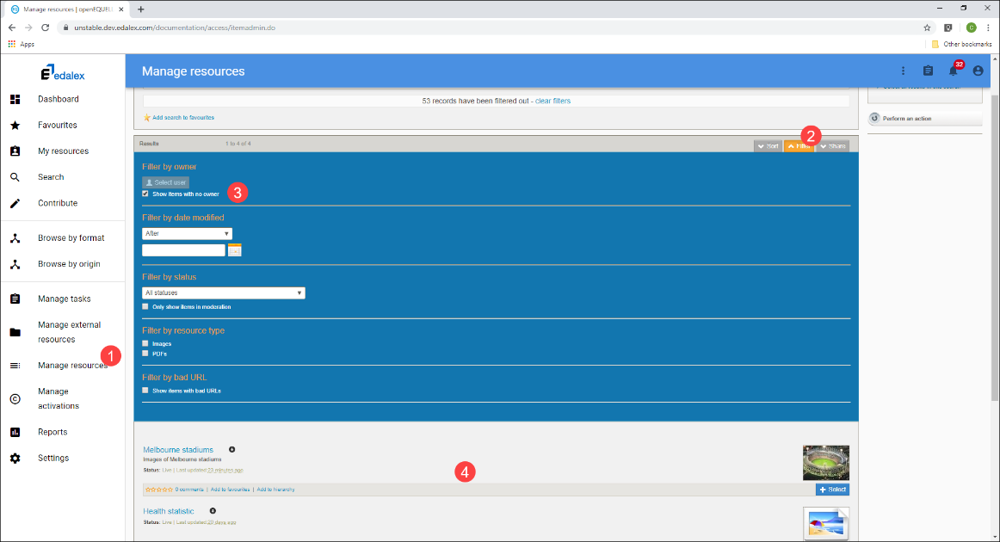

Figure 18 Manage resources - Show items with no owner filter option

Taxonomy term sorting
=====================

A new option has been added to the Taxonomy editor, Terms page to allow taxonomy
terms to be sorted alphabetically across the whole taxonomy or the child terms
for a selected taxonomy level.

##### To sort child taxonomy terms

1.  From the **Administration Console**, select **Taxonomies**. An example is
    shown in Figure 19.

   

   Figure 19 Administration Console - Taxonomies

2.  Double click the taxonomy to be sorted (or highlight and select **Edit)**.

3.  From the **Terms** tab, right click on a taxonomy level to sort the child
    terms for that level then select **Sort Child Terms**. An example before
    sorting is shown in Figure 20.

Figure 20 Selected taxonomy level

An example of the right-click menu with the sorting option in shown in Figure
21.

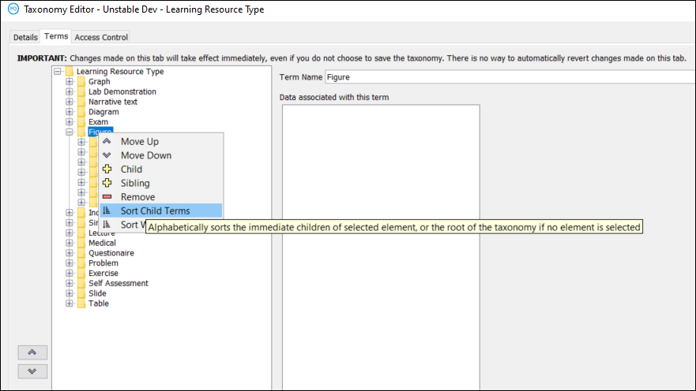

Figure 21 Right-click menu - Sort Child Terms

An example after the terms have been sorted is shown in Figure 22.

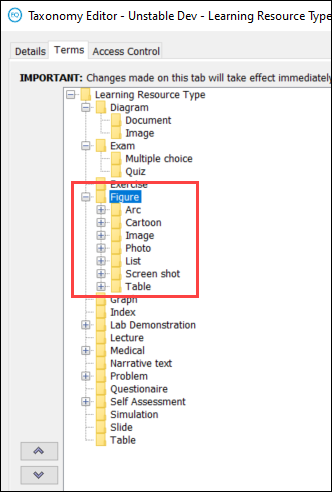

Figure 22 Sorted child terms

##### To sort across the whole taxonomy

1.  From the **Administration Console**, select **Taxonomies**. An example is
    shown in Figure 23.

   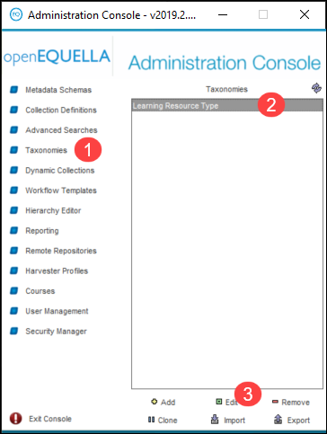

   Figure 23 Administration Console - Taxonomies

2.  Double click the taxonomy to be sorted (or highlight and select **Edit)**.

3.  From the **Terms** tab, right click on any taxonomy level then select **Sort
    Whole Taxonomy**. An example before sorting is shown in Figure 24.

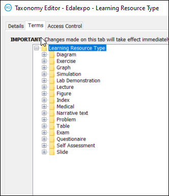

Figure 24 Sort Whole Taxonomy menu option

An example of the right-click menu with the sorting option in shown in Figure
25.

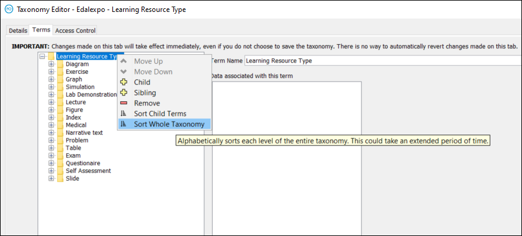

Figure 25 Right-click menu - Sort Whole Taxonomy

NOTE: Every level of taxonomy is sorted alphabetically.

An example after the terms have been sorted is shown in Figure 26.

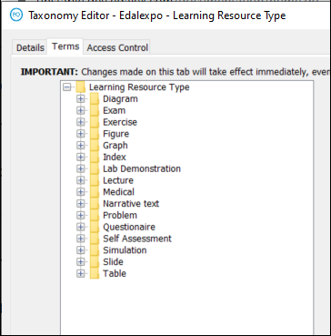

Figure 26 Sorted taxonomy
